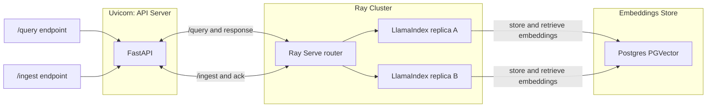

# llama-stack-demo

A demo project showcasing a scalable **LLM-powered stack** using:

- **FastAPI** → REST endpoints for ingestion & querying  
- **Ray** → orchestration and distributed task execution  
- **LlamaIndex** → indexing & retrieval for unstructured data  
- **Postgres** → vector database backend  
- **Groq LLM** → high-performance inference for embeddings & query responses  
- **Docker & Kubernetes** → containerized and deployable anywhere  

---

## Architecture


## Quick Start

git clone https://github.com/mlaguren/llama-stack-demo.git
cd llama-stack-demo

# set your Groq API key

Create .env file and add your GROQ API Key

```bash
GROQ_API_KEY=your_api_key_here
OPENAI_API_KEY=your_api_key
LANGSMITH_API_KEY=you_api_key
LANGSMITH_PROJECT=project_name
LANGSMITH_TRACING=true
```
Bring up llama-stack-demo
```bash
docker compose up --build
```
Services:

API → http://localhost:8000

# Validate Environment

```bash
curl -X POST http://localhost:8000/ingest \
  -H "Content-Type: application/json" \
  -d '{"text": "Llamas are awesome and work well in clusters."}'
```

Should get the following response:

```json
{"status":"success","message":"Document ingested."}
```
To validate your AI Keys:
```bash
curl -X POST http://localhost:8000/query \ 
  -H "Content-Type: application/json" \
  -d '{"question": "What animals work well in clusters?"}'
```

Should yield the following response:

```json
{"answer":"Llamas"}
```
