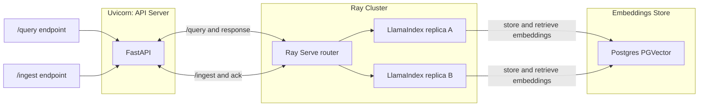

# llama-stack-demo

A demo project showcasing a scalable **LLM-powered stack** using:

- **FastAPI** → REST endpoints for ingestion & querying  
- **Ray** → orchestration and distributed task execution  
- **LlamaIndex** → indexing & retrieval for unstructured data  
- **Postgres** → vector database backend  
- **Groq LLM** → high-performance inference for embeddings & query responses  
- **Docker & Kubernetes** → containerized and deployable anywhere  

---

## Architecture


## Quick Start
```bash
git clone https://github.com/mlaguren/llama-stack-demo.git
cd llama-stack-demo
```

# set your API keys

Create .env file and add your GROQ API Key

```bash
GROQ_API_KEY=your_api_key_here
OPENAI_API_KEY=your_api_key
LANGSMITH_API_KEY=you_api_key
LANGSMITH_PROJECT=project_name
LANGSMITH_TRACING=true
```
Bring up llama-stack-demo
```bash
docker compose up --build
```
Services:

* API → http://localhost:8000
* Ray Cluster → http://localhost:8265/

# Validate Environment

```bash
curl -X POST http://localhost:8000/ingest \
  -H "Content-Type: application/json" \
  -d '{"text": "Llamas are awesome and work well in clusters."}'
```

Should get the following response:

```json
{
    "status": "success",
    "message": "Document ingested."
}
```
To validate your AI Keys:
```bash
curl -X POST http://localhost:8000/query \ 
  -H "Content-Type: application/json" \
  -d '{"question": "What animals work well in clusters?"}'
```

Should yield the following response:

```json
{"answer":"Llamas"}
```

Uploading a pdf

```bash
curl -X POST "http://localhost:8000/ingest_pdf" \
  -F "file=@path-to-pdf-file"
```

Response:
```json
{"status":"success","filename":"legends.pdf","pages_ingested":134,"chunks_ingested":138,"chars_ingested":269436}
```

Query PDF file
```bash
curl -X POST "http://localhost:8000/query" \          
     -H "Content-Type: application/json" \
     -d '{"question":"Summarize the Fox and the Wolf?"}'
```

Response
```json
{
    "answer": "The fox and the wolf lived together in the same den, with the wolf oppressing the fox. The fox advised the wolf to be kind and abandon wickedness, warning him of the cunning nature of humans. The wolf rejected the advice and struck the fox, who apologized and recited verses seeking forgiveness. The wolf accepted the apology but warned the fox to not speak out of turn. The fox, realizing the wolf's intentions, decided to act with caution and dissimulation. Despite enduring mistreatment, the fox remained patient and cautious, ultimately outsmarting the wolf by avoiding a potential trap in a vineyard.",
    "sources": [
        {
            "node_id": "b6829e9a-38f1-4bb9-88ee-59607745308e",
            "score": 0.6338359088155088,
            "filename": "legends.pdf",
            "page_number": 106
        },
        {
            "node_id": "210f70c3-91c4-423d-8237-0d14f445df2c",
            "score": 0.5692067999120484,
            "filename": "legends.pdf",
            "page_number": 107
        }
    ]
}
```
